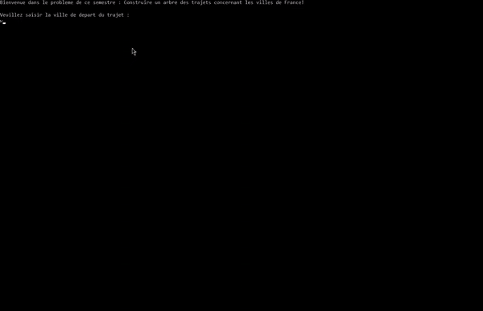

# Nary-tree-cities
This project continues my classes on the C language, and its goal is to construct links between various famous cities of France.
> A n-ary tree data structure has been employed to model the problem.
- The program can connect two cities with both the lowest travel time and distance.
- The program can print all kinks from one city to another.
- The program can print the whole travel tree.

## Demo
